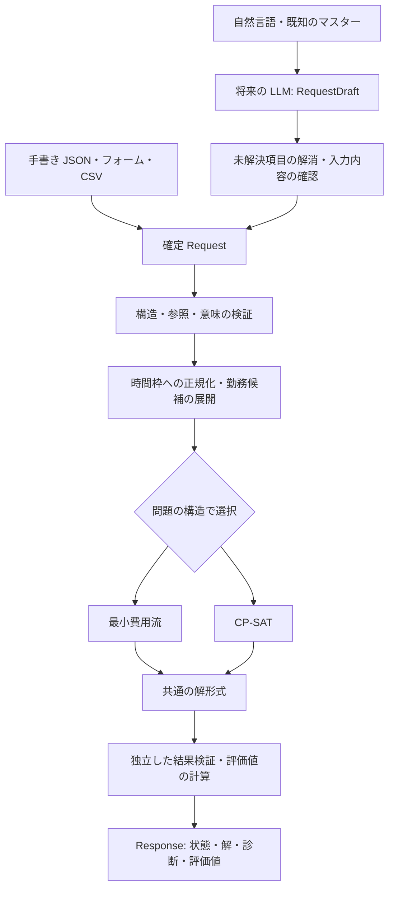

# schedula の全体像

## 目的と読者

schedula は、技能を持つ人を必要な時間・役割へ配置し、必要に応じて出退勤と休憩も
計画する、組み込み可能な最適化エンジンを目指す。
利用者が、自分の条件を表現し、解の有効性と評価値を確認できることを公開価値とする。

この文書の読者は、仕様を決める人と開発者。
読了後に、どの問題を解くか、入力に何が必要か、各処理がどこまで責任を持つかを
説明でき、[開発・検証方針](development-policy.md)から実装課題を切り出せることを目的とする。

## 最初の利用例

飲食店の11:00〜13:00に、調理・ホール・皿洗いを各1人配置する。
Aさんは調理、Bさんはホールの技能を持ち、Cさんは特別な技能を必要としない業務を担当できる。

| 条件 | 意味 |
| --- | --- |
| 各役割を1人ずつ配置する | 需要を厳密に満たす必須条件 |
| 調理・ホールには必要技能を求める | 担当資格を満たす必須条件 |
| 同じ人を同じ時間に二つの役割へ配置しない | 二重配置を防ぐ必須条件 |
| Aさん・Bさんの皿洗いをなるべく避ける | 禁止ではなく、評価に反映する選好 |

[参照入力](https://github.com/omitsuhashi/schedula/blob/601f39283339fb7fee8d4469e62c928bead19adb/docs/reference/skillshift-starter-0.1/examples/assignment.json)と
[ZIP 同梱の結果](https://github.com/omitsuhashi/schedula/blob/601f39283339fb7fee8d4469e62c928bead19adb/docs/reference/skillshift-starter-0.1/examples/assignment.result.json)では、
Aさんが調理、Bさんがホール、Cさんが皿洗いを担当し、選好のペナルティは0になる。
これは参照資料の結果であり、schedula の実行結果ではない。
技能者の皿洗いが必要な場合は、必須条件を守ったうえで選好違反を数値として返す。

調理などの役割名をエンジンに固定せず、技能と役割の設定で表す。
倉庫やイベント運営への展開は同じ構造が適用できる場合の拡張候補とする。

## 二つの問題

| 問題 | 入力で確定していること | 決めること | 現在の方式 |
| --- | --- | --- | --- |
| `assignment` | 配置可能な時間、技能、需要 | 時間帯ごとの担当役割 | 独立した問題は最小費用流、時間横断条件があれば CP-SAT |
| `roster` | 勤務可能時間、技能、需要、勤務候補、計画前履歴 | 勤務候補の選択と、その勤務中の担当役割 | CP-SAT による同時最適化 |

`assignment` の未配置は欠勤・退勤の決定を意味しない。
確定済みの勤務から担当だけを求める場合は、休憩を除いた配置可能区間を入力する。
`roster` は勤務候補から出退勤・休憩を選ぶ。人数だけで出勤者を先に固定すると
必要技能が不足する場合があるため、候補選択と担当配置を同じモデルで決める。

## 構成と責任

| 責任 | 境界 |
| --- | --- |
| 入力アダプター | フォーム・CSV などを共通契約へ変換する。未対応条件や不明値を隠さない |
| ドメイン契約と検証 | ID、時間、需要、制約の意味を統一し、不正な入力を拒否する |
| 候補生成と正規化 | 区間を時間枠へ展開し、短いテンプレートから有限の勤務候補を生成する |
| ソルバー | 検証済みの問題を解き、解の有無と最適性の状態を報告する |
| 結果検証と説明根拠 | 制約を別の処理で照合し、評価値・診断コードを出す |
| 将来の LLM | 入力候補の作成と、結果に含まれる根拠に基づく説明を行う |

最適化の中核は LLM や外部サービスへの通信なしに動く構成とする。
フォーム、CSV、LLM、Web API は同じ契約を利用し、個別の入力経路に固有の業務判断を
ソルバーへ埋め込まない。論理的な責任分担であり、初期から別サービスに分割する決定ではない。

## 現在の範囲

通常入口はJSON契約0.15のみです。担当配置、有限候補と担当の同時最適化、夜勤・分割・休憩、
勤務量・休息・連勤、元需要の不足と必須最低人数、需要priority、勤務希望、公平性、
基準・固定・重複期間の再計画、確認済み実績と確定勤務、矛盾縮小・許可変更案、
勤務費用・指定区間偏差・日数・勤務分類/パターン・同僚条件・勤務回数目標を扱います。
現在の入力・尺度・既定値・拒否条件・証明と実行上限は[現行契約](io-contract-current.md)にまとめます。

店舗間移動・給与計算・法令判定・候補外の連続時刻探索は扱いません。
新しい条件は入力・求解・独立検証・Schema・型・利用側まで同時に設計し、
[互換性とサポート方針](contract-support.md)に従います。

## 公開物の方向

中心は最適化ライブラリと CLI、JSON Schema、ルール説明、入力例、評価用データ。
次に SDK・API・CSV アダプターを整え、ブラウザーデモでコードを書かずに試せる入口を作る。
セルフホスト用の配布形態も検討対象とする。LLM 入力は中核の検証後に追加する。

参照実装は Python 3.11 以上を前提に、最小費用流を純 Python、CP-SAT を OR-Tools で実装している。
schedula でもこの構成を実装の出発点として採用する。
Web・SDK の TypeScript 採用、Web フレームワーク、DB、認証、Docker 配布、ホスティングは未決定。
公開条件は[開発・検証方針](development-policy.md)で定める。

## 現在地と証拠

ライブラリ・CLI・Schema・公開型・ローカルJSON/フォーム/Adapterデモを提供しています。
分割入力は所有元・確認・由来を保持し、組立時には探索しません。保存済み実行記録の証拠と
現在の独立検証を分け、採用・基準・反復再計画を行えます。
[README](../README.md)から導入と試用を実行できます。最小費用流と独立検証にはOR-Toolsが不要です。

CIは全体回帰・skip拒否・隔離wheel/sdist・公開型・base/cp-satと実Chromiumを確認します。
固定規模の架空評価は時間・RSS・目的値・不足・証明範囲を保存し、実顧客の性能保証とは区別します。
[移行・結合の記録](migrations/contract-0.15-integration.md)を参照してください。
PyPI公開・GitHub Release・実顧客デプロイは未実施です。
過去のZIPと契約追加時の文書は履歴として保持します。由来は[出典](sources.md)、用語は[用語集](../GLOSSARY.md)が正本です。
